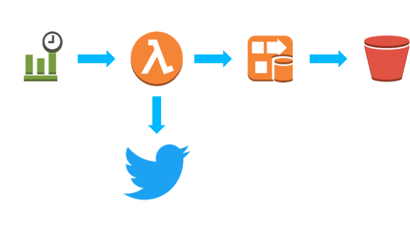
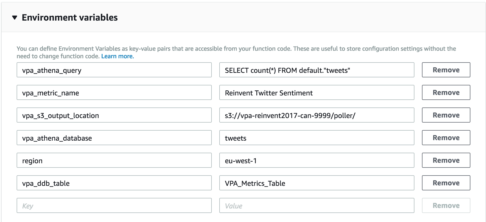

# Voice Powered Analytics - Athena Lab 

In this lab, we will work with Athena and Lambda. 

The goal of the lab is to use Lambda and Athena to create a solution to query data at rest in Amazon S3 and build answers for Alexa. 

The data for this workshop is twitter data stored in a public S3 bucket filtered on #reinvent, #aws, or @AWSCloud. 

<strong>For this lab we will use the us-east-1 (N. VA) region. Double check you are in that region </strong>


### How we get the data into S3

The data is acquired starting with a CloudWatch Event triggering an AWS Lambda function every 5 minutes. Lambda is making calls to Twitter's APIs for data, and then ingesting the data into [Kinesis Firehose](https://aws.amazon.com/kinesis/firehose/).

Firehose then micro-batches the results into S3 as shown in the following diagram: 





## Step 1 - Create an Athena table


We need to create a table in Amazon Athena. This will allow us to query the data at rest in S3 from QuickSight. The twitter data is stored as JSON documents and then compressed in s3. Athena supports reading of gzip files and includes json SerDe's to make parsing the data easy.

There is no need to copy the dataset to a new bucket for the workshop. The data is publicly available in the bucket we provide.

<strong>Create Athena Table </strong>

1. Please make sure you are in the **same region** that launched the Cloudformation stack 
2. For the **Ireland region**, modify the location field below with the following location: LOCATION 's3://aws-vpa-tweets-euw1/tweets/' 
3. In your AWS account navigate to the **Athena** service 
4. In the top left menu, choose *Query Editor* 
5. Use this code to create the Athena table. Make sure to change tweets_<your-alias> to add your alias (e.g. tweets_alexe)
6. Once added, click **Run Query** 

```sql
CREATE EXTERNAL TABLE IF NOT EXISTS default.tweets_<your-alias>(
  id bigint COMMENT 'Tweet ID', 
  text string COMMENT 'Tweet text', 
  created timestamp COMMENT 'Tweet create timestamp', 
  screen_name string COMMENT 'Tweet screen_name',
  screen_name_followers_count int COMMENT 'Tweet screen_name follower count',
  place string COMMENT 'Location full name',
  country string COMMENT 'Location country',
  retweet_count int COMMENT 'Retweet count', 
  favorite_count int COMMENT 'Favorite count')
ROW FORMAT SERDE 
  'org.openx.data.jsonserde.JsonSerDe' 
WITH SERDEPROPERTIES ( 
  'paths'='id,text,created,screen_name,screen_name_followers_count,place_fullname,country,retweet_count,favorite_count') 
STORED AS INPUTFORMAT 
  'org.apache.hadoop.mapred.TextInputFormat' 
OUTPUTFORMAT 
  'org.apache.hadoop.hive.ql.io.HiveIgnoreKeyTextOutputFormat'
LOCATION
  's3://aws-vpa-tweets/tweets/'
```


**Verify the table created correctly**

1. You'll see an Athena table called tweets_<your-alias> in the *default* database (You may have to hit refresh). 
2. If you click on the *tweets*_<your-alias> table, you can see the fields that we saw earlier. 
3. Let's test that the tweets table works. In the same Query Editor run the following SELECT statement (clear the previous statement): 

```sql
SELECT COUNT(*) AS TOTAL_TWEETS FROM tweets;
```


The statement above shows the total amount of tweets in our data set. **Note** The result should be in the 1000's. If you got a tiny number, something is wrong. Recreate your table or ask one of the lab assistants for help.


## Step 2 - Create a query to find the number of reinvent tweets. 

We need to produce an integer for our Alexa skill. To do that we need to create a query that will return our desired count.

1. To find the last set of queries from Quicksight, go to the Athena AWS Console page, then select **History** on the top menu. 
2. You can see the latest queries under the column **Query** (starting with the word 'SELECT'). You can copy these queries to a text editor to save later. 
3. We'll be running these queries in the **Query Editor**. Navigate there in the top Athena menu. 
4. Ensure that the **default** database is selected and you'll see your **tweets_<your-alias>** table. 
5. The Athena syntax is widely compatible with Presto. You can learn more about it from our [Amazon Athena Getting Started](http://docs.aws.amazon.com/athena/latest/ug/getting-started.html) and the [Presto Docs](https://prestodb.io/docs/current/) web sites 
6. Once you are happy with the value returned by your query you can move to **Step 3**, otherwise you can experiment with other query types. 
7. Let's write a new query. Hint: The Query text to find the number of #reinvent tweets is:  <code>SELECT COUNT(*) FROM tweets </code>


<strong>Optional - Try out a few additional queries (and Attendee Submissions). </strong>

```sql
--Total number of tweets
SELECT COUNT(*) FROM tweets

--Total number of tweets in last 3 hours
SELECT COUNT(*) FROM tweets WHERE created > now() - interval '3' hour

--Total number of tweets by user chadneal
SELECT COUNT(*) FROM tweets WHERE screen_name LIKE '%chadneal%'

--Total number of tweets that mention AWSreInvent
SELECT COUNT(*) FROM tweets WHERE text LIKE '%AWSreInvent%'

** Attendee Submissions **
-- Submitted by Patrick (@imapokesfan) 11/29/17:
SELECT screen_name as tweeters,text as the_tweet
from default.tweets
where text like '#imwithslalom%'
group by screen_name, text

-- Submitted by Cameron Pope (@theaboutbox) 11/29/17:
SELECT count(*) from tweets where text like '%excited%'
```


## Step 3 - Create a lambda to query Athena

In this step we will create a Lambda function that runs every 5 minutes. The lambda code is provided, but please take the time to review the function. 

1. Go to the AWS Lambda console page. 
2. Click Create Function
3. Click Author one from scratch 
4. Under name add <your-alias>_vpa_lambda_athena_poller. Example, alexe_vpa_lambda_athena_poller. 
5. For Runtime, select <strong>Python 3.6</strong>
6. Under Role, leave the default value of Choose an existing role
7. Under existing role, select VPALambdaAthenaPollerRole_<stack_name> (get the stack name from your administrator).
8. Click Create Function. 


### Function Code 

1. For Handler, ensure that it is set to: lambda_function.lambda_handler
2. Select inline code and then use the code below

```python
import boto3
import csv
import time
import os
import logging
from urllib.parse import urlparse

# Setup logger
logger = logging.getLogger()
logger.setLevel(logging.INFO)


# These ENV are expected to be defined on the lambda itself:
# vpa_athena_database, vpa_ddb_table, vpa_metric_name, vpa_athena_query, region, vpa_s3_output_location

# Responds to lambda event trigger
def lambda_handler(event, context):
    vpa_athena_query = os.environ['vpa_athena_query']
    athena_result = run_athena_query(vpa_athena_query, os.environ['vpa_athena_database'],
                                     os.environ['vpa_s3_output_location'])
    upsert_into_DDB(str.upper(os.environ['vpa_metric_name']), athena_result, context)
    logger.info("{0} reinvent tweets so far!".format(athena_result))
    return {'message': "{0} reinvent tweets so far!".format(athena_result)}


# Runs athena query, open results file at specific s3 location and returns result
def run_athena_query(query, database, s3_output_location):
    athena_client = boto3.client('athena', region_name=os.environ['region'])
    s3_client = boto3.client('s3', region_name=os.environ['region'])
    queryrunning = 0

    # Kickoff the Athena query
    response = athena_client.start_query_execution(
        QueryString=query,
        QueryExecutionContext={
            'Database': database
        },
        ResultConfiguration={
            'OutputLocation': s3_output_location
        }
    )

    # Log the query execution id
    logger.info('Execution ID: ' + response['QueryExecutionId'])

    # wait for query to finish.
    while queryrunning == 0:
        time.sleep(2)
        status = athena_client.get_query_execution(QueryExecutionId=response['QueryExecutionId'])
        results_file = status["QueryExecution"]["ResultConfiguration"]["OutputLocation"]
        if status["QueryExecution"]["Status"]["State"] != "RUNNING":
            queryrunning = 1

    # parse the s3 URL and find the bucket name and key name
    s3url = urlparse(results_file)
    s3_bucket = s3url.netloc
    s3_key = s3url.path

    # download the result from s3
    s3_client.download_file(s3_bucket, s3_key[1:], "/tmp/results.csv")

    # Parse file and update the data to DynamoDB
    # This example will only have one record per petric so always grabbing 0
    metric_value = 0
    with open("/tmp/results.csv", newline='') as f:
        reader = csv.DictReader(f)
        for row in reader:
            metric_value = row['_col0']

    os.remove("/tmp/results.csv")
    return metric_value


# Save result to DDB for fast access from Alexa/Lambda
def upsert_into_DDB(nm, value, context):
    region = os.environ['region']
    dynamodb = boto3.resource('dynamodb', region_name=region)
    table = dynamodb.Table(os.environ['vpa_ddb_table'])
    try:
        response = table.put_item(
            Item={
                'metric': nm,
                'value': value
            }
        )
        return 0
    except Exception:
        logger.error("ERROR: Failed to write metric to DDB")
        return 1
```


### Envrionment Variables 

You will need the S3 bucket name that was created as part of the CloudFormation stack earlier.

If you forgot the name of your bucket you can locate the name on the output tab of the CloudFormation stack.


Set the following Environment Variables: 

<strong>vpa_athena_database:</strong> tweets_<your-alias> (e.g. tweets_alexe)

<strong>vpa_ddb_table:</strong> VPA_Metrics_Table_<your_stack_name> (you should see this value as output from the stack you created earlier)

<strong>vpa_metric_name:</strong> Reinvent Twitter Sentiment

<strong>vpa_athena_query:</strong> SELECT count(*) FROM default."tweets_<your-alias>"

<strong>region:</strong> us-east-1 (if running out of Northern VA.) or eu-west-1 (If running out of Ireland)

<strong>vpa_s3_output_location:</strong> s3://<your_s3_bucket_name>/poller/ (Note: Use your bucket name. This was provided as output to the CloudFormation stack you created earlier. For example, s3://vpa-athenaoutputs3bucket-1wmhsqrk54s6f/poller/)


<strong>Screenshot</strong>



### Basic Settings

Set the timeout to 2 min


### Triggers Pane 

We will use CloudWatch Event Rule created from the CloudFormation template to trigger this Lambda. Scroll up to the top of the screen, select the pane <strong>Triggers</strong>. 

1. Under the Add trigger, click the empty box icon, followed by CloudWatch Events. 
2. Scroll down, and under Rule, select <your-stack-name>-VPAEvery5Min (e.g. alexe-VPAEvery5Min). 
3. Leave the box checked for Enable trigger. 
4. Click the Add button, then scroll up and click Save (the Lambda function)


## Step 4 - Create a test event and test the Lambda 

At this point we are ready to test the Lambda. Before doing that we have to create a test event. Lambda provides many test events, and provides for the ability to create our own event. In this case, we will use the standard CloudWatch Event.

### To create the test event

1. In the upper right, next to test, select **Configure test events** 
2. Select **Create new test event** 
3. Select **Select Amazon CloudWatch** for the event template 
4. Use **VPASampleEvent** for the event name 
5. Click **Create** in the bottom right of the window 

### Now we should test the Lambda. 

1. Click **test** in the upper right 
2. Once the run has completed, click on the **Details** link to see how many reinvent tweets are stored in s3.

Note, there should be > 10,000 tweets. If you get a number lower than this please ask a lab assistant for help. 

## Start working on the Alexa skill 

You are now read to build the Alexa skill. Go ahead and move forward to the next lab. 

