# Voice Powered Analytics - Alexa Skills Lab

In this lab you will build a voice powered analytic engine that you can take back to your stakeholders to deliver valuable company insights. Common questions that may be asked, “Alexa, how many Unique Users did our site have last month?” and “Alexa, how many orders have breached their delivery SLA this week?”. 

## Alexa Skill Building 

### Step 1: Setting up Your Voice User Interface

There are two parts to an Alexa skill. The first part is the Voice User Interface (VUI). This is where we define how we will handle a user's voice input, and which code should be executed when specific commands are uttered. The second part is the actual programming logic for our skill. Both will be configured in this step-by-step guide. 

Alexa fits into your Voice Powered Analytics architecture as the interaction interface for retrieving metrics. Alexa determines what metrics to retrieve through intents (which we'll describe and configure in the next steps). The intents correspond to metrics in your DynamoDB data store, which Lambda functions retrieve and send back to the Alexa-enabled device to communicate back to the user: 

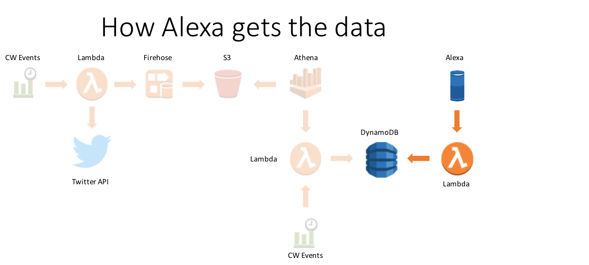

1. Go to the [Amazon Developer Portal](http://developer.amazon.com/)

2. Click the **Alexa button** on the left portion of the screen.

   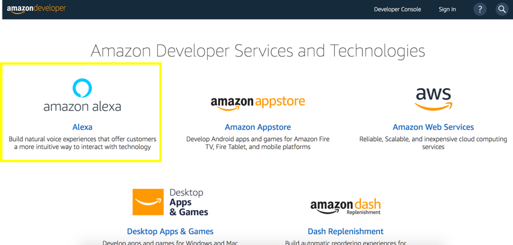

3. In the top-right corner of the screen, **click the Sign In button**. (If you don't already have an account, you will be able to create a new one for free.)

4. Once you have signed in, on the Alexa page, **click the Alexa Skills Kit button**, which is what we'll use to create our custom skill.

   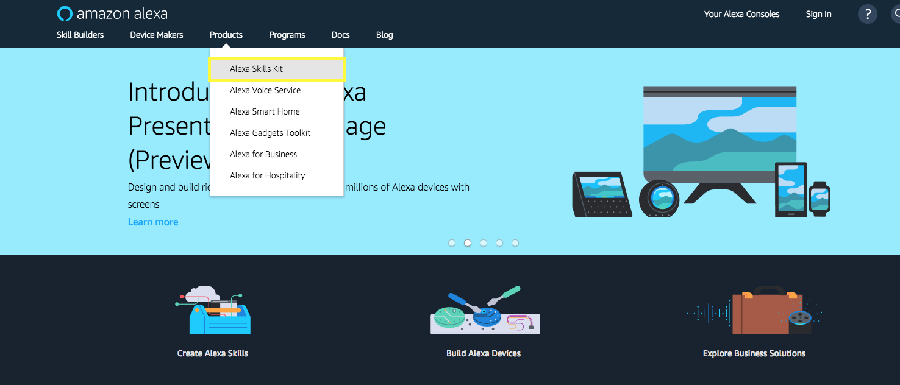

5. Next **Click on Start a Skill Button**

   

6. Click on Create Skill button to start creating a custom skill.

   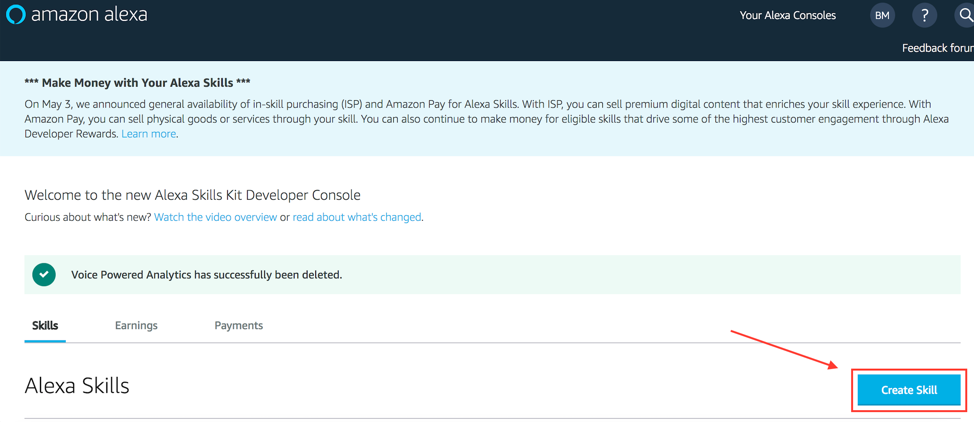

7. Type in the **Skill name** *<Your_alias> Voice Powered Analytics*, Select the **Custom** button and finally click the **Create Skill** button:

   

8. Select the option **Start From Scratch**,then select the **Choose** button in the top righthand corner:

   

9. Next, **Click on 1. Invocation Name >**

   

10. Ensure the skill innvocation name is entered (if not, type:) **voice powered analytics** (all lower case)

    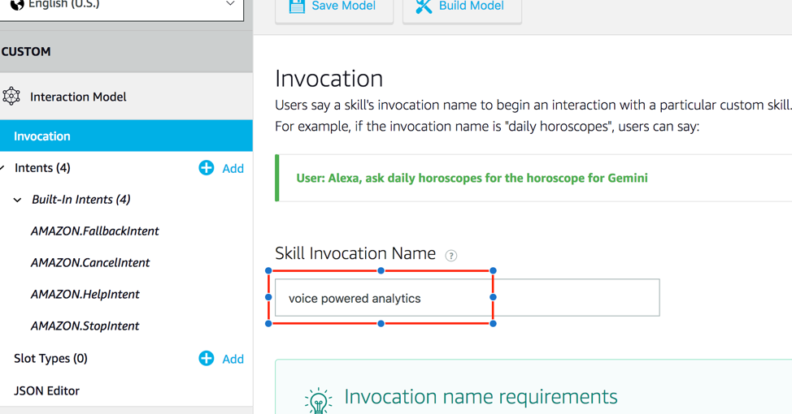

11. **Click on + Add button** next to Intent.

    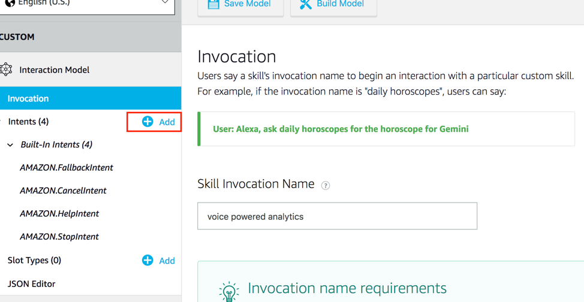

12. **Type the custom intent name** *WhatsMyMetric* and **click Create Custom Intent button**

    

13. Next we're going Add utterances to our intent. This triggers an invoke of your intent through your user's voice. You'll want to add a few different variations based upon how users will interact with the different types of metrics available to query.

- Type the **What’s my {metric}** (ignore the popup box) and **Click + sign** to add the utterance.

  

14. Now we'll configure our Slots. Slots allow you to parameterize different variable attributes when invoking your intent. For this workshop, the slot will be our metric(s) that we've created with the Athena query. This is why we've put the {metric} slot name in our utterances.

- **Click on + Add** on the left menu, next to Slot.

  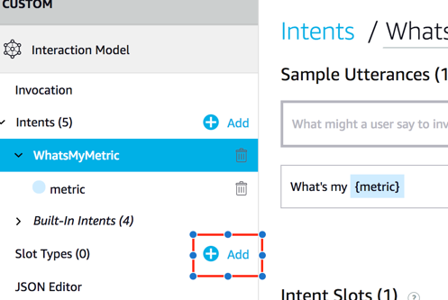

- **Type available_metrics** and **click Create custom slot type**

  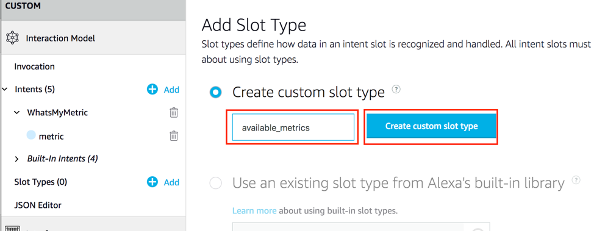

- For the slot value, **enter the value of the metric** used from the *Athena_Poller* Lambda function's environment variable: metric (e.g. *reinvent twitter sentiment*). Then **click the + button**. Note: The DynamoDB item that is used as our key in the backend lambda function uses this value to query our metric's value.

**Note: Don't worry about adding ID (Optional) or Synonyms. They can be added later after you test.**

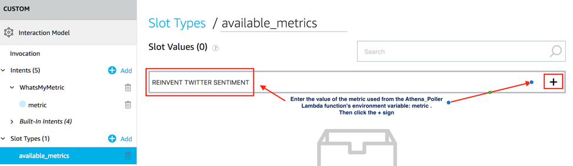

15. **Click on WhatsMyMetric** on the left menu under Intents. Then **select available_metrics** in the dropdown menu next to metric.

    

16. Now **click on Build Model**. This will save your model and build it.

    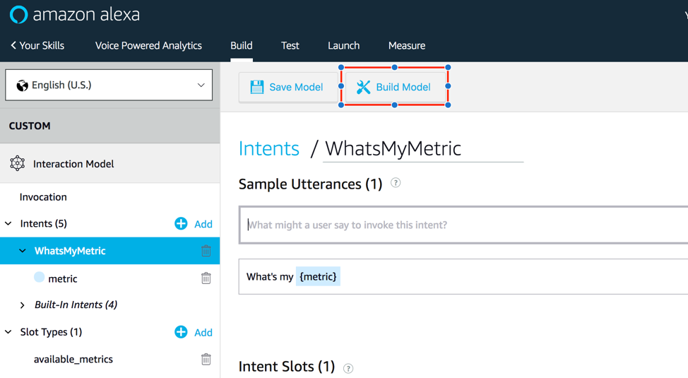

17. You should see: 

18. It may take a minute or two to build, if your interaction model builds successfully you'll see a successful build message added to the dialog:

**Troubleshooting** If you get an error from your interaction model, check through this list:

- Did you copy & paste the provided code into the appropriate boxes?
- Did you accidentally add any characters to the Interaction Model or Sample Utterances?

In our next step of this guide (Configure Alexa Backend), we will be linking a Lambda function in the AWS developer console.

### Step 2: Configure Alexa Backend

Now that we've configured the voice interaction, let's set up your Lambda function to be triggered by your Alexa Skills Kit and leverage your DynamoDB metrics. Note: When you ran the initial setup CloudFormation, a Lambda function with the name starting with **::Stack Name::-AlexaMetricSkill** was deployed.

1. Check your **AWS region** as the Lambda function needs to be in the same region as the resources created earlier.

2. **Open the Lambda function, starting with ::Stack Name::-AlexaMetricSkill** that was deployed with the Setup Cloudformation. Then we'll **Configure your trigger**: Under Configuration, and in **Add Triggers** pane, **select Alexa Skills Kit** from the list. It will then add this trigger to your Lambda function.

3. **Scroll down to Configure Triggers**, **click Skill ID verification disable**. Note: optionally you can use the Alexa Skill ID to lock down the lambda function to your specific Alexa Skill; this is a best practice. Next, click the **Add** button, then scroll to the top of the Lambda function and click **Save**

   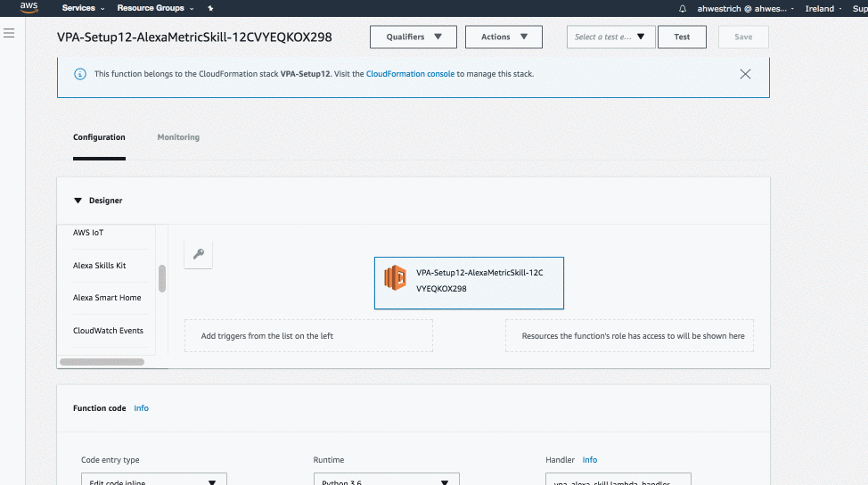

4. **Copy your Lambda function's ARN value to a separate text editor** The *ARN value* is in the top right corner. We'll use this in the next section of the guide.

5. Next, **click the Configuration Tab**, then click on the Lambda function icon and name button **.starting with ::Stack Name::-AlexaMetricSkill** to go back to your code.

   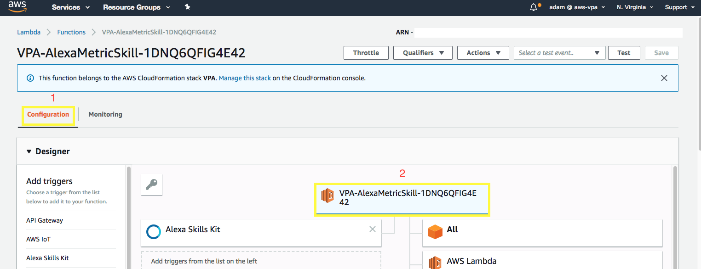

6. Scroll down beneath the code and navigate to **Environment Variables**.

7. **Validate/or change the environment variables**: - **intent_name** matches what's configured for your *intent* in the Alexa Skill's Interaction Configuration - **slot_name** matches what's configured for your *slot name* in the Alexa Skill's Interaction Configuration - (Optional) You can modify the greeting and exit message for your Alexa skill by changing the value of two environment variables: **greeting_msg** and **exit_msg**

### Step 3: Connecting Your Voice User Interface to Your Lambda Function

In Step 1 "Setting up Your Voice User Interface", we created a voice user interface for the intents and utterances we expect from our users.

In Step 2 "Configure Alexa Backend", we created a Lambda function that contains all of our logic for the skill. In this step, we need to connect those two pieces together.

1. **Go back to the Amazon Developer Portal** and **select your skill (Voice Powered Analytics)** from the list. You may still have a browser tab open if you started at the beginning of this tutorial.

2. **Click on Endpoint** on the left menu. Then **Select the AWS Lambda ARN**.

   

3. **Paste the ARN** you copied in number 3 of Step 2 to Default Region.

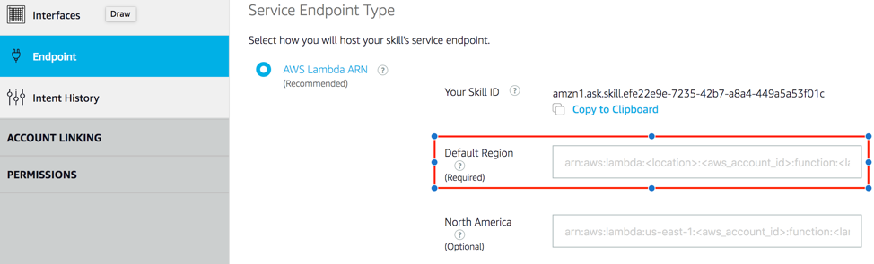

4. Click **Save Endpoints**

   

   Note: For this skill, we won't be using Account Linking, but you can learn more about Linking an Alexa User with a User in Your System

5. Congratulations: You are all set to test your skill.

### Step 4: Testing Your Alexa Skill

You've now created a Voice User Interface and a Lambda function, and connected the two together. Your skill is now ready to test.

1. In the [Amazon Developer Portal](http://developer.amazon.com/), **select your skill (e.g. Voice Powered Analytics)** from the list. You may still have a browser tab open if you started at the beginning of this tutorial.

2. **Click on "Test"** tab on the top.

   

3. Enable testing for the skill by clicking slider button

   

4. Once enabled, type *“ask Voice Powered Analytics”* and **click the Mic button**

   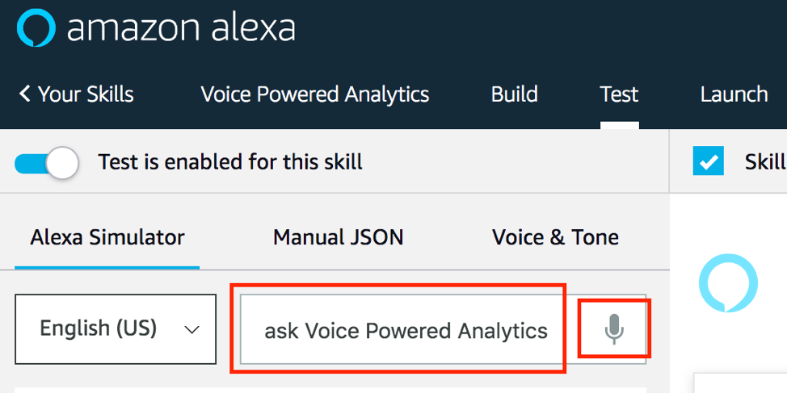

   Note: You should see the results on the right window

   

5. You can have an entire conversation with your skill with the Service Simulator. Try the following commands:

- *"what is my reinvent twitter sentiment"*

Note: If your sample skill is working properly, you can now customize your skill.

